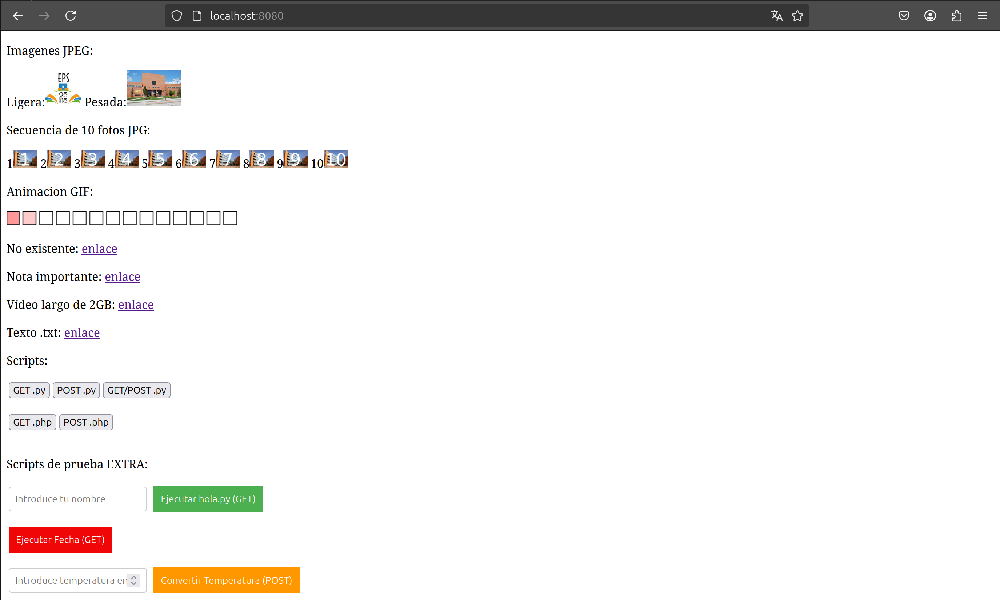

# Servidor Web Práctica 1 Redes 2

## Descripción

Este repositorio contiene el código y la documentación para la práctica 1 de la asignatura **Redes 2**. El proyecto consiste en el desarrollo de un servidor web que es capaz de procesar peticiones HTTP 1.0 y 1.1. El servidor devuelve archivos proporcionados por el profesorado y es capaz de manejar imágenes multimedia y ejecutar scripts de prueba.

Este proyecto es una implementación que pone en práctica conceptos fundamentales de redes y servidores web, permitiendo la gestión eficiente de las solicitudes y respuestas HTTP.

## Badges

Este proyecto no tiene badges activos en este momento.

## Visuals

A continuación, se muestra una imagen representativa del funcionamiento del servidor (ha de estar corriendo):



## Instalación

Para instalar y ejecutar este proyecto en tu máquina local, sigue los siguientes pasos:

1. **Clonar el repositorio**:

    ```
    git clone https://github.com/marcosmm1701/Servidor-Web/
    ```

2. **Navegar al directorio del proyecto**:

    ```
    cd web_server_P1
    ```

3. **Compilar el código fuente**:

    Este proyecto utiliza `make` para la compilación. Asegúrate de tener `make` instalado y ejecuta el siguiente comando para compilar:

    ```
    make
    ```

    Esto generará los archivos binarios necesarios.

4. **Limpiar archivos compilados** (opcional):

    Si necesitas limpiar los archivos generados durante la compilación, utiliza el comando:

    ```
    make clean
    ```

### Requisitos

- **Compilador C** (gcc o similar)
- **make** para la compilación
- **Linux** (en Windows puedes usar WSL o alguna herramienta como Cygwin)

## Uso

Una vez que hayas instalado el servidor, puedes ejecutar el servidor con el siguiente comando:

run_server - servidor sin valgrind
runv_server - servidor con valgrind
run_client - cliente sin valgrind
runv_client - cliente con valgrin

El servidor escuchará las peticiones HTTP en el puerto 8080 por defecto. Puedes probarlo con cualquier navegador web accediendo a http://localhost:8080/


## Soporte

Si encuentras algún problema o tienes preguntas sobre el proyecto, por favor abre un **issue** en el repositorio o contacta a través del correo electrónico de soporte: [ignacio.serena@estudiante.uam.es] o [marcos.munnozmerchan@estudiante.uam.es].

## Roadmap

- **Fase 1**: Implementación de servidor básico (Peticiones HTTP 1.0/1.1)
- **Fase 2**: Soporte para manejo de imágenes y archivos multimedia
- **Fase 3**: Ejecución de scripts de prueba
- **Fase 4**: Optimización del rendimiento y escalabilidad

## Contribuciones

Este proyecto es una entrega de clase y no se aceptan contribuciones externas. Está destinado únicamente a fines académicos y no está abierto a colaboraciones fuera del contexto de la asignatura.

## Autores y reconocimiento

Este proyecto ha sido desarrollado por **Marcos Muñoz

## Estado del Proyecto

Este proyecto está en finalizado.


